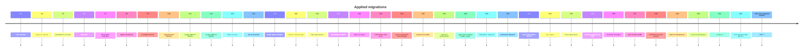

# Auto-generated — core Flyway ledger (applied files are immutable; next free number below).

```mermaid
timeline
    title Applied migrations
    V1 : core schema
    V4 : currency varchar
    V5 : idempotency records
    V6 : idp policy
    V7 : portal demo subtypes
    V8 : approval payload
    V9 : ui widget harness
    V10 : signed portal delivery
    V11 : plugin platform identity
    V12 : plugin platform registry
    V13 : retire core kyc
    V14 : act as sessions
    V15 : plugin types columns
    V16 : person checker flag
    V19 : roles governance
    V20 : psp plugin consent
    V21 : bank accounts
    V23 : notifications and push
    V24 : person password must change
    V25 : persons list index
    V26 : inventory permissions
    V28 : approvals pending target unique
    V29 : notification channels
    V30 : auth plane dispatch
    V31 : push subscription version
    V32 : sku orders
    V33 : recon permission
    V34 : role menu grants org units
    V36 : customer activation
    V37 : auth channel width
    V38 : notification snooze resolve
    V39 : branch maintenance
    V40 : invoice permissions
    V41 : invoices
    V42 : drop signed portal delivery

**Next free migration number: V43.**
```
